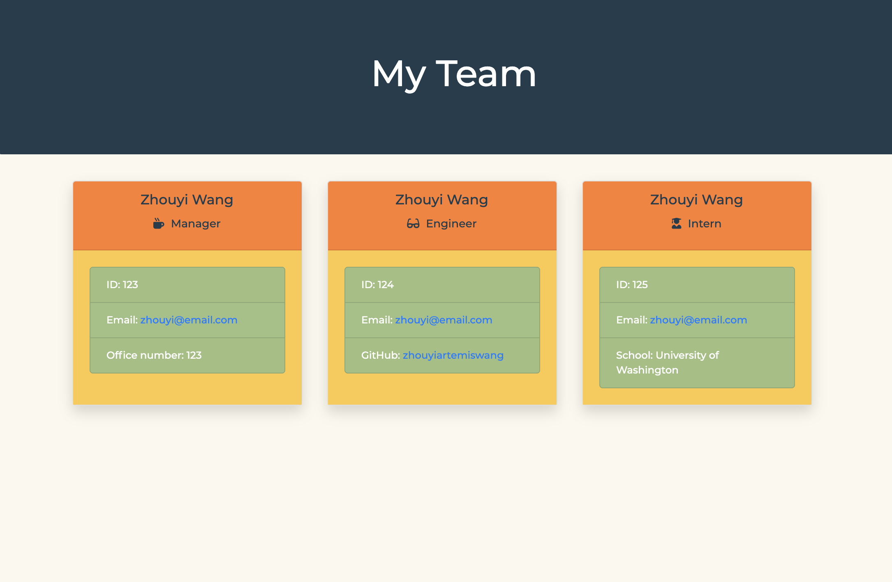

# Employee Profile Generator

## Description 
This project builds a Node CLI that takes in information about employees and generates an HTML webpage that displays summaries for each person. 

## Table of Contents 
* [Installation](#installation)
* [Usage](#usage)
* [License](#license)
* [Contribution](#contribution)
* [Tests](#tests)
* [Questions](#questions)

## Installation
Install dependencies:
```
npm install 
```

## Usage
Step 1 Invoke the application

```
node app.js
```

Step 2 Answer all prompted questions

Step 3 You will find `team.html` in the `output` folder


Note: you can click on email to send an email and click on GitHub username to browse that person's GitHub page.



Please checkout the [walk-through video](https://drive.google.com/file/d/12UCauACthUg9P9jSqLKqAZRknDhaBvpO/view) for demonstration.


## License

```
Copyright 2020 Employee Profile Generator

Permission is hereby granted, free of charge, to any person obtaining a copy of this software and associated documentation files (the "Software"), to deal in the Software without restriction, including without limitation the rights to use, copy, modify, merge, publish, distribute, sublicense, and/or sell copies of the Software, and to permit persons to whom the Software is furnished to do so, subject to the following conditions:
        
The above copyright notice and this permission notice shall be included in all copies or substantial portions of the Software.
        
THE SOFTWARE IS PROVIDED "AS IS", WITHOUT WARRANTY OF ANY KIND, EXPRESS OR IMPLIED, INCLUDING BUT NOT LIMITED TO THE WARRANTIES OF MERCHANTABILITY, FITNESS FOR A PARTICULAR PURPOSE AND NONINFRINGEMENT. IN NO EVENT SHALL THE AUTHORS OR COPYRIGHT HOLDERS BE LIABLE FOR ANY CLAIM, DAMAGES OR OTHER LIABILITY, WHETHER IN AN ACTION OF CONTRACT, TORT OR OTHERWISE, ARISING FROM, OUT OF OR IN CONNECTION WITH THE SOFTWARE OR THE USE OR OTHER DEALINGS IN THE SOFTWARE.
```
        
## Contribution 

No other contributions.

## Tests

npm run test

## Questions 
GitHub Username: zhouyiartemiswang

GitHub Profile: [github.com/zhouyiartemiswang](https://github.com/zhouyiartemiswang) 

GitHub Repo: [github.com/zhouyiartemiswang/employee_summary](https://github.com/zhouyiartemiswang/employee_summary)

Please email additional questions to wzyzhouyi@gmail.com. 
